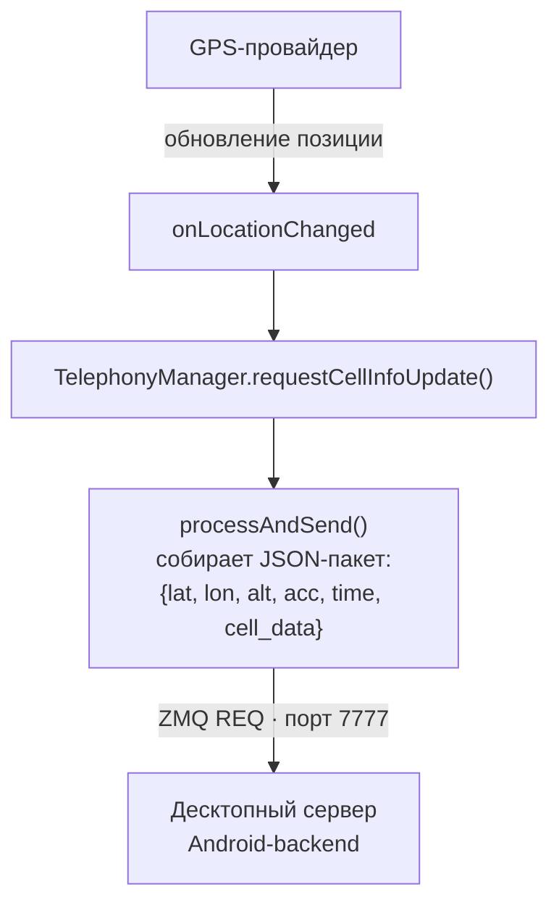

# МФП — Android-клиент

Android-приложение (Kotlin) для сбора данных о мобильной сети и геолокации с отправкой телеметрии на десктопный сервер по ZeroMQ.

## Как это работает



`NetworkLoggingService` работает как **Foreground Service** — сбор продолжается даже при свёрнутом приложении. Каждые ~2 сек при изменении GPS-позиции запрашивается актуальная информация о соте и отправляется пакет.

## Экраны приложения

| Экран | Что делает |
|-------|-----------|
| **MainActivity** | Главное меню — навигация между экранами |
| **NetworkMap** | Запуск/остановка `NetworkLoggingService`, отображение статуса |
| **MobileData** | Просмотр данных текущей соты (тип, RSRP, PCI и др.) |
| **Location** | Текущие GPS-координаты и точность |
| **ZeroMQ** | Тестирование ZMQ-соединения (локальный сервер + удалённый) |
| **Calculator** | Калькулятор |
| **MediaPlayer** | Воспроизведение медиафайлов |

## Поддерживаемые типы сетей

| Тип | Метрики |
|-----|---------|
| **LTE** | RSRP, RSRQ, RSSI, RSSNR, CQI, PCI, TAC, band |
| **NR (5G)** | ssRSRP, ssRSRQ, ssSINR, PCI, NCI, band |
| **GSM** | RSSI (ASU), dBm, timingAdvance, BSIC |

## Структура проекта

```
app/src/main/java/com/example/calculator/
├── MainActivity.kt           # Главное меню
├── NetworkMap.kt             # Управление фоновым сервисом
├── NetworkLoggingService.kt  # Foreground service: GPS + соты + ZMQ
├── MobileData.kt             # Просмотр данных соты
├── Location.kt               # Просмотр геолокации
├── ZeroMQ.kt                 # Тест ZMQ-соединения
├── CalculatorActivity.kt     # Калькулятор
└── MediaPlayer.kt            # Медиаплеер
```

## Разрешения

Приложение запрашивает:

- `ACCESS_FINE_LOCATION` / `ACCESS_BACKGROUND_LOCATION` — GPS
- `READ_PHONE_STATE` — данные сот
- `INTERNET` — отправка по ZMQ
- `FOREGROUND_SERVICE_LOCATION` — фоновый сервис

## Сборка

Открыть в **Android Studio**, собрать и установить на устройство

> Адрес сервера задаётся в `NetworkLoggingService.kt`:
> ```kotlin
> private val serverAddress = "tcp://192.168.x.x:7777"
> ```
